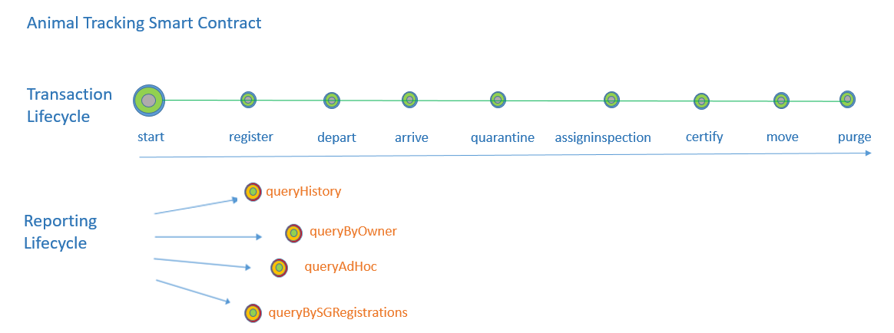
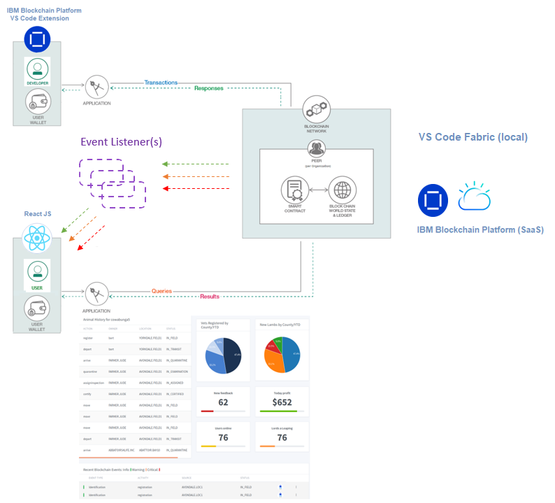

---

# Front matter (metadata).

abstract: "Develop, integrate and deploy your smart contract, and integrate with a simple React-based dashboard app"

authors:
  - name: "Paul O'Mahony"
    email: "mahoney@uk.ibm.com"

completed_date: "2018-07-18"

components:
  - "hyperledger-fabric"
  - "hyperledger"
  - "IBM Blockchain Platform"
  - "IBM Blockchain Platform VSCode extension"

draft: false

excerpt: "Develop, integrate and deploy your smart contract, and integrate ledger history and events into a React-based app"

meta_description: "Learn how to develop/deploy a Typescript Smart Contract using IBM Blockchain VSCode Extension, invoke transactins/queries and render the results in a React Dashboard App"

meta_keywords: "animal tracking, queries, smart contract, IBM Blockchain, IBM blockchain platform, VSCode extension, typescript, Hyperledger Fabric, React"

last_updated: "2019-07-21"

primary_tag: "blockchain"

pta:
 - "emerging technology and industry"

pwg:
  - "blockchain"

related_content:
  - type: announcements
    slug: ibm-blockchain-platform-vscode-smart-contract
  - type: articles
    slug: make-smart-contracts-smarter-with-analytics
  - type: patterns
    slug: create-and-execute-blockchain-smart-contracts

related_links:
  - title: "Part 1: Run a Commercial paper smart contract with the IBM Blockchain VSCode extension" 
    url: "https://developer.ibm.com/series/blockchain-running-enhancing-commercial-paper-smart-contract/"
  - title: "Video: Start developing with the IBM Blockchain Platform VSCode Extension"
    url: "https://youtu.be/0NkGGIUPhqk"
  - title: "Sample commercial paper smart contract"
    url: "https://github.com/hyperledger/fabric-samples"
  - title: "Hyperledger Fabric docs: Commercial paper tutorial"
    url: "https://hyperledger-fabric.readthedocs.io/en/master/tutorial/commercial_paper.html"

# runtimes:

# series:                 # OPTIONAL
#  - type:
#    slug:

services:
 - "blockchain"

subtitle: "Deploy a Typescript Smart Contract locally, then to IBM Cloud SaaS and integrate events/ledger data with a locally deployed React-based client Dashboard app"

tags:
  - "animaltracking" "typescript" "react" "government" "dashboard" "blockchain" "ibm blockchain" "ibm blockchain platform" "ibm blockchain platform vscode extension" "ibp" "ibp2" "SaaS"

title: "Use the IBM Blockchain Platform VSCode extension to deploy a Smart Contract locally, then promote to IBM Blockchain SaaS, and integrate events and ledger data with a sample React-based client dashboard app"

type: tutorial

---

## Introduction

This hands-on tutorial shows how to integrate query data and events from a blockchain ledger, into a client-side React Dashboard app. It uses the [IBM Blockchain Platform VS Code extension](https://marketplace.visualstudio.com/items?itemName=IBMBlockchain.ibm-blockchain-platform) as the developer platform to manage the smart contract and clients - and essentially orchestrates the activity in this tutorial. The smart contract and the client apps, both written in Typescript, make use of the new features of the [new Hyperledger Fabric programming model](https://hyperledger-fabric.readthedocs.io/en/release-1.4/developapps/developing_applications.html) (available since 1.4). 

The IBM Blockchain Platform VS Code developer extension is used to interact with two different environments - one local, one Cloud.

The tutorial flow takes you through deploying locally, and then you promote your contract to the Cloud. 

You will launch a locally installed React application client dashboard, which will automatically render the source data (queries and events) in the dashboard portal - firstly from a local Fabric environment (one started in IBP VS Code extension), then one configured in the [IBM Blockchain Platform in IBM Cloud](https://cloud.ibm.com/docs/services/blockchain?topic=blockchain-ibp-console-build-network)

There are two sections: 

  - the first, the development lifecycle: deploy everything local ; use the IBM Blockchain Platform VS Code extension to manage the full IDE, stand up the runtime local Fabric and drive transactions, invoke an event listener. Then switch to the browser to show integration to the React client app ; 
    
  - the second, the promotion lifecycle: package up the contract in IBP extension and promote it to a Cloud instance, the IBM Blockchain Platform SaaS - once again, use the IBP VS Code extension to drive transactions, invoke the listener. Then again, show your React App interacting with data from the source IBP cloud ledger. 
    
The tutorial provides the end-to-end steps to stand up a React-based dashboard client containing a not-so-fictitious animal co-operative dashboard app, which providing summary charts, and ledger-based query and event data (emitted by the contract) sourced from the blockchain ledger (we're particularly interested in SHEEPGOATS actually :-) !).  Deployed to the same ledger and Fabric channel, is a Typescript-based animaltracking smart contract that we will interact with from application clients, and the dashboard.

NOTE: All data that is rendered from the blockchain will have a 'lock' icon alongside the record for viewing purposes.

Figure 1. "Overview of React App Dashboard interacting with a Blockchain network (lock icons)"

The tutorial uses an 'intermediate' level, model-based Typescript contract and is aimed at Developers who wish to understand how to run this contract and then integrate resultant blockchain data into a locally installed sample React JS based application, based on (Tabler UI React-based Dashboard)[https://github.com/tabler/tabler-react]. Take time to see what's going on - you don't necessarily have to understand Typescript, Javascript or React in great detail to understand this !  The lifecycle of typical transactions contained in the animal tracking contract is shown below.

As mentioned, we're using IBM Blockchain Platform VSCode Extension - and the new Fabric programming model and SDK features under the covers - to complete these tasks. In particular, you will use Query and Event Typescript application clients - in addition to the IBP VS Code extension, to perform the required actions in this tutorial.

## Background

## Scenario

The use case centres around an Animal Co-operative dashboard, and the need to source the truth from the ledger for reporting purposes.

Jane Pearson has been at CONGA Co-op for 10 years now, and of late, she has taken on a very special role: she is responsible for keeping a handle on the SHEEPGOAT numbers, as a species their numbers needs growing, data concerning their welfare or any incidents need to be monitored - Jane needs key stats about SHEEPGOATS at her fingertips. While all data on the dashboard is important, part of her remit is to monitor any events affecting SHEEPGOATS in the co-op region - whether information level 'green' events (like new registrations), or more critical ones such as quarantined SHEEPGOATs (now that's a worry) and she also needs to know they are imminently being inspected by a specialised SHEEPGOAT Vet.

Jane relies heavily on her dashboard app, in particular the events, from which she can instigate any inline actions.

## Pre-requisites

1. You will need to have the following installed in order to proceed:

* (Node v8.x or greater and npm v5.x or greater)[https://nodejs.org/en/download/]
* (Yeoman (yo) v2.x)[https://yeoman.io/]
* (Docker version v17.06.2-ce or greater)[https://www.docker.com/get-started]
* (Docker Compose v1.14.0 or greater)[https://docs.docker.com/compose/install/]
* VS Code — see the (marketplace)[https://marketplace.visualstudio.com/items?itemName=IBMBlockchain.ibm-blockchain-platform] for the minimum version to install
* Yarn - install yarn as follows in your $HOME directory:

     * `npm install yarn`

2. For Part 2 of this tutorial - deploying and integrating the dashboard App and smart contract to IBM Blockchain Platform SaaS - you will need to have an (IBM Blockchain Platform blockchain network)[https://cloud.ibm.com/catalog/services/blockchain] installed and running.

## Preparatory Steps

1. From a Terminal window, create a project directory (as a non-root user on Linux) called `dash`   eg assume `$HOME/dash` is the starting point 

`cd $HOME/dash` to enter that directory

2. Clone the `tabler-react` Github repository:

`git clone https://github.com/tabler/tabler-react.git`

3. Clone the `animaltracking` Github repository:

`git clone https://github.com/mahoney1/animaltracking.git`

4. IF you've previously deployed the `animal-tracking` smart contract, would suggest to perform a `teardown` in the IBM Blockchain Platform VS Code extension (click on the icon) in VS Code - then select 'FABRIC OPS', click in the '...'  select 'TearDown Runtime Fabric' and confirm you want to tear down. After doing a teardown, start a new Fabric, again from 'FABRIC OPS' .....click on 'Start New Fabric' and ensure that you have a running, functional Fabric, and with the Nodes started, in the left sidepanel.

5. In VSCode, connect to your local Fabric Gateway under the 'Fabric Gateways' sidepanel, and use the`admin` identity to connect.

6. In VSCode Explorer, choose File > Open Folder, and navigate to the `animaltracking` folder in your cloned repo - then select the `contracts` folder, eg. navigating to the `$HOME/animaltracking/contract` directory. The `contract` folder must be your top-level project folder in VSCode before proceeding

7. Click on the IBM Blockchain Platform icon and from '...' ellipses on the 'Smart Contract Packages' panel, choose to 'Package a Smart Contract' - choose `animaltracking-ts@0.0.1`. You should get confirmation the package was successfully created.

8. Next, under 'Local Fabric Ops' choose to 'Install' the package onto the local peer - await a successful install message in VS Code.

9. Next, instantiate the `animaltracking-ts` Smart Contract by choosing 'Instantiate'  and when prompted, select `animaltracking-ts@0.0.1` as the contract to instantiate. 

    - When prompted to provide a function, supply the text:
      `org.example.animaltracking:instantiate` 
      and hit ENTER.
      
    - Hit ENTER to accept the remaining defaults for the remaining parameters when prompted. 
    
In approx. one minute or less, you should get confirmation the contract was successfully instantiated and you should see the instantiated contract called `animaltracking-ts@xxx`, under the 'Fabric Local Ops' pane.

10. Replace the HOME directory assignment in these typescript files (currently it is '/home/demo') - to your own home directory ('/home/userxx') in the following TS files:
`EventClient.ts`
'EventClient_IBP.ts`
`QueryClient.ts`
`QueryClient_IBP.ts`
`QueryEvents.ts`

next, run:

`npm run build` to compile to Javascript.

11. For Part 2 of this tutorial, you will need an (IBM Blockchain Platform SaaS instance)[https://cloud.ibm.com/catalog/services/blockchain-platform] and have completed the (Build a network tutorial)[https://cloud.ibm.com/docs/services/blockchain?topic=blockchain-ibp-console-build-network]

Successful completion of these pre-reqs, is the basis from which this tutorial can now proceed. 

## Estimated time

After the prerequisites are completed, this should take approximately *60 minutes* to complete.

OK, lets get started !

# PART 1: Integrate React Dashboard App, Blockchain Ledger data with a Local Fabric instance

## Steps

### Step 1. Perform an NPM install in the Typescript Client directory

We need to install dependencies for our client applications - to do this:

1. Change directory to the client:

`cd $HOME/dash/animaltracking/client`

2. Do an NPM install of dependencies:

`npm install`

### Step 2. Install packages for React Dashboard using Yarn

1. Change directory to the cloned `tabler-react` directory and perform an install using the yarn package manager:

`cd $HOME/dash/tabler-react`

`yarn install`

2. Backup some existing files in `tabler-react` - both in `src` and in the `example/src` subdirectories as follows:

`cd src`

`cp Tabler.css Tabler.css.bak`

`cd ../example/src`

`cp HomePage.react.js HomePage.react.js.bak`

`cp SiteWrapper.react.js SiteWrapper.react.js.bak`

(The above copies are merely so that you can do a `diff` of the changes made, to implement the animal tracking dashboard. Check out in particular, the `json` objects in `HomePage.react.js`, that represent JSON coming from the blockchain, via queries and events.

3. Now copy in / move the customisations from the `animaltracking` cloned repo as follows - **perform steps in the `example/src` subdirectory** in your Tabler React directory:

`cp $HOME/dash/animaltracking/react/* .`

`mv Tabler.css ../../src`

4. Create a symbolic link to where our ledger data is persisted (for this tutorial, the React DashBoard App picks up data from a persisted file)

`ln -s ledger $HOME/dash/animaltracking/typescript/client/lib`

### Step 3. Start the React Dashboard app

1. Start the React dashboard app - change directory one level, to the `example` directory:

`cd ..`

`yarn start`

2. You should get a browser launched with the Dashboard app active (when writing this tutorial, it launched Firefox on Ubuntu)
 
### Step 4. In IBP VS Code extension, pre-populate the ledger with demo data

1.  In IBP in the VSCode extension, expand the `animaltracking-ts@xxx` contract under 'Fabric Gateways'. You will see a list of transactions. Scroll down to the end and you will find a transaction called `setupdemo`. We'll use this to pre-populate the ledger with some sample data.

2. Right-click on `setupdemo` and select `Submit Transaction` - accept all the default prompts for parameters (don't need to enter anything) etc - we won't need to supply any parameters.

### Step 5. In a VS Code terminal window, start the Contract Event Listener

1. Still in VS Code, click on the `Terminal` tab at the bottom - press ENTER if prompted to `hit any key to close`. You should now have a command prompt - change directory to the animaltracking `client` directory (from the `contract` subdirectory):

`cd ../client/lib`

2. Start the local Event Listener by running the bash script `listenLocal.sh`:

`./listenLocal.sh`

You should get messages ("Getting Listener" etc) that its started and you should also see an event from the earlier `setupdemo` transaction (during setup, an event for a SHEEPGOAT registration was emitted).

### Step 6. Invoke Transactions in sequence to register further events

1. Go back to the list of `animaltracking-ts` transactions under 'Fabric Gateways' and right-click on `register` ... `Submit Transaction`.  When prompted, paste the following parameter list - including the double-quotes "" : in between the two square brackets `[ ]` in the VS Code prompt: 

`"SHEEPGOAT 000011 24/07/2019 BOVIS_ARIES FARMER.JOHN AVONDALE.LOC1 ARRIVALF1 IN_FIELD WOOL false"`
 
2. Click on the adjacent Terminal in VS Code and check that we had an event reported by the Event Listener for id `000011` .

3. Go back to the transaction list - this time, right-click on `quarantine` ... `Submit Transaction` . When prompted: paste these 2 parameters (each separated by double-quotes), in between the square brackets at the parameters prompt:

`"SHEEPGOAT", "000011"`

4. Once again, check from the terminal window that you've got an `ISOLATION` event posted.

5. Lastly, select the transaction `assigninspection` ... `Submit Transaction` . When prompted, paste the following into the square brackets:

`"SHEEPGOAT", "000011", "VET00007"`

6. Once again, check the Event Listener pane - we should have an INSPECT event reported.

We now have 4 events: an initial registration (from setupdemo), a new SHEEPGOAT registration, and two lifecycle events for this SHEEPGOAT.

7. In the Terminal window with the running Event Listener, stop it using CONTROL and C to stop. You should see an `Events Processed` message after interruption. We now have a set of 4 events, in JSON, contained in a file called `events.json`

(Note: generally, these events would picked up by an application using either Websockets (more efficient) or AJAX (less efficient) calls from the React or node application using React to render the UI. But for the purposes of this tutorial, we will write the events (emitted by the contract) to a simple JSON file: it is this that the React Dashboard app picks up, to dynamically present the ledger data in the application.

8. We also want to query all SHEEPGOAT registrations from the ledger, and present this in the dashboard. To do this, we need to run the QueryClient script as follows:

`cd $HOME/dash/animaltracking/client/lib`

`node query.js`

The script performs a number of queries, some of which are fulfilled given the ledger state at this point - however, the data we're interested in, will be the last query performed - and the results are written to a file called `registrations.json` and which our Dashboard will automatically pick up.

### Step 7. Check the React Dashboard App for new Query and Events

Many of the charts/area diagrams contain summarised data can can be derived from the ledger, whether aggregated, calculated or indeed - in the case of temperatures trends - data that is aggregated from IoT temperatures over a period of time - this is just an example.

The data we're interested is 'new registrations' and separately, a 'Blockchain Events' table.

1. Switch to your browser launched earlier - all the data/records we're interested in contains a grey/blue 'lock' icon

2. Check that you have a list of new SHEEPGOAT registrations - these are the list of registrations extracted by the Query client earlier.

3. Scroll down to 'Recent Blockchain Events' - these represent our 4 blockchain events emitted by the `animaltracking-ts` Contract instantiated on channel `mychannel` and which were picked up by our Contract Listener earlier.

Well done! You've now completed this first part of the tutorial.

# PART 2: Integrate React Dashboard App, Blockchain Ledger data from an IBM Blockchain Platform SaaS instance

Note: If you wish to complete this part, and you are not already signed up for an IBP Cloud instance, you will need to do so (here)[https://cloud.ibm.com/catalog/services/blockchain-platform]. Otherwise, access your service instance in the usual fashion through the IBM Kubernetes resource list. In my case it is called ('IBPDemo')

The critical info, you will need for when you create your IBP SaaS instance (based on the ('Build your network tutorial')[https://cloud.ibm.com/docs/services/blockchain?topic=blockchain-ibp-console-build-network]) tutorial is the following (note: always check the source for the names/ids used) - the `animaltracking/client/lib` IBP-related .ts files (and compiled .js files) use the following currently:

MSP ID = 'org1msp'
Registered Identity = 'ibpuser'
Channel = "channel1"
Instantiate Parameter = "org.example.animaltracking:instantiate" (ie when prompted to enter it for contract instantiation)
Contract Name = "animaltracking-ts";

When you create your IBM Kubernetes Cluster on IBM Cloud, take a note of it's name in IBM Kubernetes, if you need to re-launch the IBP console at any point (and you have other services etc)  - you can elect to create a cluster now, as you create a Blockchain Service (available under 'Catalog'......'Blockchain') or you can connect to an existing cluster in IBM Cloud - make sure to give your Service name a meaningful name like 'IBPDemo'

(Creating the Blockchain Service)[img/ibpdemo-svc.png]

## Steps

### Step 1. Export CDS package and install/instantiate the contract using a peer Admin in IBP SaaS

We will need to package up our TypeScript smart contract into a (CDS file)[https://hyperledger-fabric.readthedocs.io/en/release-1.4/chaincode4noah.html#packaging] to deploy as a chaincode package for the IBP SaaS environment. We can do this easily from the IBM Blockchain Platform VS Code extension

1. Click on the IBP extension icon in the sidebar, and under 'Smart Contract Packages' select `animaltracking-ts@0.0.1` and right-click .... 'export Package' . Accept the default file name `animaltracking-ts@0.0.1.cds` and export it to a temporary directory on your filesystem. You should get a 'successful export' message popup at the bottom.

2. Login to your IBM Blockchain Platform Cloud instance and launch the IBM Blockchain Platform Console, close the welcome banner if required.

3. Click on the 'Smart Contracts' tab in your single-Org IBP SaaS environment. As part of my build a network tutorial, I associated a peer admin identity (of type 'peer'), having added it to my wallet. Choose the 'Smart Contracts' tab and click on 'Install Smart Contract'. Upload your CDS package from earlier and 'Install Smart Contract' - await the 'success' message.

<install smart contract img>
  
4. Next, click on the 'Overflow' menu alongside the `animaltracking-ts` smart contract. On the side panel that opens, select the channel `channel1` to instantiate the smart contract on - click Next. 
  
5. Accept the default endorsement policy and select the Org MSP set up for your environment: `org1msp`

6. Next, select the Org1 peer which is already joined to the channel. Skip the 'private data collections' prompt and click Next to proceed to instantiation

7. Lastly, enter `org.example.animaltracking:instantiate` when prompted to enter an initialisation function. Then accept the defaults thereafter. Your contract should be successfully instantiated on the channel `channel` and appear in the instantiated contracts further down the same panel.

## Step 2. Register an IBP identity and export wallet for use later

1. Click on the 'Org1 CA' node and click on the button to 'Register User' - register a user 'ibpuser' with an enrol secret of 'demo' - 'register user'. This user will be the identity we use to invoke transactions, run queries etc from the IBP VS Code extension later.

2. Next, click on the action list for 'ibpuser' and choose to 'Enrol' ... enter the id and secret you entered above and click Next

3. Enter a 'display name' of 'ibpuser' and click on 'Export Identity' - this will prompt you to save the identity to your local filesystem as a JSON file - we will use this later.

## Step 3. Export the connection profile to use in the IBP VS Code extension as a Gateway Connection

1. From the 'Smart Contracts' panel, scroll down to the 'Instantiated Smart Contracts' section

2. Click on the Overflow menu and select 'Connect with SDK'

3. Enter 'org1msp' for the MSP choice and 'Org1 CA' as the Certificate Authority of choice. Scroll down to the end and click on 'Download Connection Profile' - 

4. The exported file will be called something like `channel1_animaltracking-ts_profile.json` in your Downloads directrory - rename this connection JSON file locally as `connection_IBP.json` and move it to your $HOME directory. This directory location will be used later by the Query Client application script that will query the IBP SaaS `channel` based ledger FYI.

## Step 4. Setup the IBP Gateway and import the Wallet to connect to IBP SaaS environment

1. Back in the IBP VS Code panel in your local development environment, disconnect from any currently connected local gateways.

2. Under 'Fabric Gateways' click on the '+' icon to 'add a new Gateway' - give it a name of IBPGW when prompted and Browser for the file `connection_IBP.json` in your HOME directory, click Select and it should be added successfully.

3. Next, import the `ibpuser` wallet which was exported as JSON file earlier. Click on the '+' symbol under 'Fabric Wallets'

4. Select to 'Create a new wallet and add identity' and give it a name of `ibpuser` . Next enter `ibpuser2` in response to the 'name of the identity' prompt

5. Enter 'org1msp' when prompted to enter an MSP ID and hit ENTER

6. Choose the 'Provide a JSON file' when prompted to choose a method for adding an identity and browser for the `ibpuser.json` file in your HOME directory - select this. You should see messages that it was imported successfully and it will appear on the list.

7. Now connect to the Gateway under the 'Fabric Gateways' panel and click on 'IBPGW' - select to connect with the user `ibpuser`. You will see that this user is now connected through the IBPGW gateway as highlighted in the graphic below. We are now ready to try out our integration from the React Dashboard app, all the way through to the SaaS environment. At this point of course, we have no ledger data in the Saas environment, so we will need to populate it and start creating some transactions.

## Step 5. Execute transactions and test out integration of new events, queries from the IBP SaaS environment

1. From the IBP VS Code extension, expand the channel `channel` and the `animaltracking-ts@0.0.1` instantiated contract to reveal the list of available transactions - scroll down to the `setupdemo` transaction.

2. Right-click on `setupdemo` and click 'Submit Transaction' and when prompted, supply a value of "IBP" inside the 'parameter' prompt -  hit ENTER to accept all the remaining default prompts - this will populate our ledger with some new registrations and which are prefixed 'IBP' - so we can see the data is different in our dashboard.

3. Click on the terminal window in VS Code and from the `animaltracking/typescript/client/lib` subdirectory: start our IBP event listener process from the command prompt as follows:

`./listenIBP.sh`

You'll get messages that it is started and we should see an event has already occurred from the `setupdemo` transaction where new registrations means an emitted event.

4. Go back to the list of `animaltracking-ts` transactions under 'Fabric Gateways' and right-click on `register` ... `Submit Transaction`.  When prompted, paste the following parameter list - including the double-quotes "" : in between the two square brackets `[ ]` in the VS Code prompt: 

`"SHEEPGOAT IBP-000099 24/07/2019 BOVIS_ARIES FARMER.JOHN AVONDALE.LOC1 ARRIVALF1 IN_FIELD WOOL false"`
 
5. Click on the adjacent Terminal in VS Code and check that we had an event reported by the Event Listener for id `000011` .

6. Go back to the transaction list - this time, right-click on `quarantine` ... `Submit Transaction` . When prompted: paste these 2 parameters (each separated by double-quotes), in between the square brackets at the parameters prompt:

`"SHEEPGOAT", "IBP-000099"`

7. Once again, check from the terminal window that you've got an `ISOLATION` event posted.

8. Lastly, select the transaction `assigninspection` ... `Submit Transaction` . When prompted, paste the following into the square brackets:

`"SHEEPGOAT", "IBP-000099", "VET00007"`

9. Once again, check the Event Listener pane - we should have an INSPECT event reported.

We now have 4 events: an initial registration (from setupdemo), a new SHEEPGOAT registration, and two lifecycle events for this SHEEPGOAT.

10. In the Terminal window with the running Event Listener, stop it using CONTROL and C to stop. You should see an `Events Processed` message after interruption. We now have a set of 4 IBP events (with very recent timestamps), in JSON, contained in a file called `events.json`

11. We also want to query all SHEEPGOAT registrations from the ledger, and present this in the dashboard. To do this, we need to run the QueryClient script as follows:

`cd $HOME/dash/animaltracking/client/lib`

`node query_IBP.js`

The script performs a number of queries, some of which are fulfilled given the IBP SaaS ledger state at this point - results are written to a file called `registrations.json` which is automatically detected/rendered by the React Dashboard App.

### Step 6. Check the React Dashboard App for new Query and Events

Once again, the data we're interested in our Dashboard app are the 'new registrations' and separately, the 'Blockchain Events' table.

1. Switch to your React Dashboard browser tab launched earlier - all the data/records we're interested in contains a grey/blue 'lock' icon

2. Check that the refreshed list of new SHEEPGOAT registrations - these are the list of registrations extracted by the IBP Query client above.

3. Scroll down to 'Recent Blockchain Events' - these represent our 4 IBP blockchain events (one from `setupdemo`, one from `register` and one each from `quarantine` and `assigninspection`) emitted by the `animaltracking-ts` Contract instantiated on channel `channel1` in IBP SaaS and which were picked up by our IBP Contract Listener above.

Well done! You've now completed this section of the tutorial.

## Conclusion

This tutorial aimed to show a simple use case, of combining the new features of:

  - the IBM Blockchain VS Code extension to manage the whole development inside VS Code - a powerful and seamless IDE for the developer.
  - Fabric 1.4's new programming model (eg, application client SDK, gateways, wallets, event SDK enhancements, and of course the new Fabric Contract changes)
  - Typescript Contract and Client applications (Event Listeners, Query Clients etc)
  - Tabler React (the Github project at https://github.com/tabler/tabler-react for a React-based Dashboard app
  - Adding customisations, suited to the use case / Ledger data being extracted.
  - starting local, verifying from your IBM Blockchain IDE that everything works locally ; then promote the smart contract to an IBM Blockchain Platform Cloud instance, and show integration to that SaaS environment from your IBP Clients and the React Dashboard app.
    
Thanks for trying it out! If you have any issues, please raise an issue on my Github project (click 'Issues') with full details of the problem you're facing - thanks!)

As a last step, it is good practice to close out your current folders in VS Code, in preparation for your next tutorial or project.
